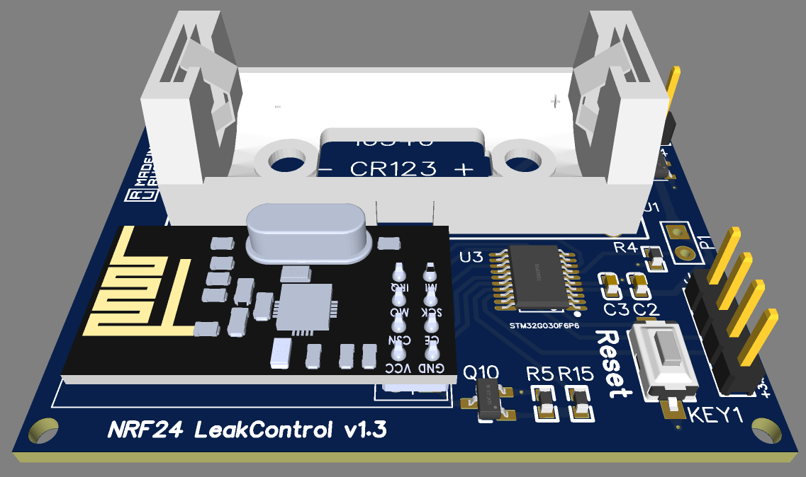

# Radio module for leak monitoring

The module is a board based on STM32G030F6P6 microcontroller and NRF24L01 radio module.
The module is designed to detect water leaks and notify the head unit about them.
This version of the module is powered by the 16340 (CR123) battery which should be enough for 12 months of operation.



The default operation logic of the module is as follows:
1. Deep sleep for one minute;
2. Humidity sensor interrogation;
3. In case the threshold value is exceeded, send a message via NRF24L01 to the head unit which controls the devices;

## Sensor general circuit
The radio sensor design itself is on EasyEDA https://easyeda.com/leech001/leakcontrol.

## Software description

A project source code based on the HAL library is available.
The project itself is generated in STM32CubeMX.

Setting up the pipe identifier
```
const uint64_t pipe1 = 0xF0F0F0F0A1LL;
```
Setting up speed
```
setDataRate(RF24_250KBPS);
```
Setting up channel
```
setChannel(76);
```
Adjusting the sensor threshold
```
if (water > 200) {
```
Сonfigure the period for sending the sensor status (min)
```
if (up_count == 0 || up_count >= 360)
```

For those who are not strong, there is a ready-made binary that just needs to be write in microcontroler (https://github.com/leech001/rf-leak-module/releases).
